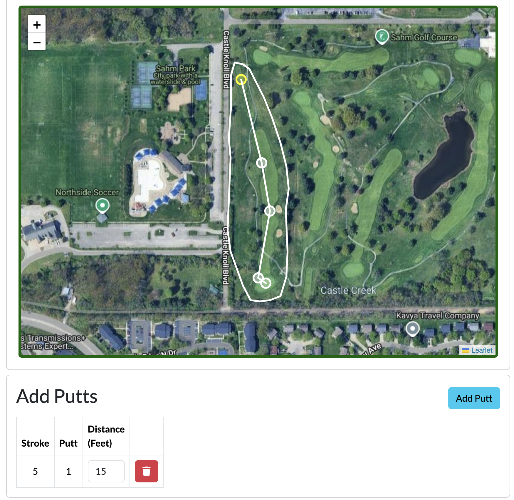

# A Year in Review: 2024

This is my first year with the new site, and I thought I'd continue stealing ideas from other blogs I like by doing a "Year in Review". No guidelines, except for writing about what I want to write. Its good to keep records.

## Blog Posts

This year I wrote <b>7 posts</b>, including this one. Honestly, it's not a lot, but I'm fine with it. I made this site so that I'd have somewhere to post anything and everything from random thoughts and essays to fleshed out technical guides, but that doesn't mean I should be putting out things for the sake of putting them out. The internet is full of pointless shit that doesn't or shouldn't be said, so there's no need to add to the noise.

## Career

I moved jobs this year; my first real move in my career. Quitting my first job was one of the hardest things I've ever done. After I formally put in my notice, I began to do the rounds to colleagues to let them know myself that I'd soon be gone. I turned back to my office, whom I shared with my friend and mentor Tom, and saw him standing side-by-side with my boss. They both had their arms crossed, and gazed at me with dissappointed, but understanding looks. That stung. It can be hard to say goodbye to people you care about and who have been so good to you. I had to fight very hard not to feel shame and guilt over 'abandoning' those who had given me every opportunity to succeed in the first stage of my career. Saying goodbye is never easy. But it was the right thing to do. I care more about my work now. I'm more driven. I have a new team around me that I get to learn new things from. I have new opportunities. I got what I needed.

One of the harder things was going from hybrid/1-day in the office to hybrid/3-days. If I'm brutally honest with myself, I was kidding myself when I ever said that "only 1 day in the office" was good for me. Going to 3 days in the office has been a challenge, and I feel like the first few years of my career being fully-remote maybe wired me to reject the office as a place I want to be. I have found that I have a _really_ hard time now just sitting still, surrounded by other people in noisy shared spaces. Even when I want to be productive, it can be a struggle, sometimes even physically. My first month, I suffered from frequent headaches, I can only imagine from the white fluorescent lights and _brring_ noise machines. Physiologically, my body was telling me that this place was bad. _Go home. Go back to where it's comfortable._ But like I said, working from home is not the best for me. Despite the new challenges, I do enjoy going into the office, and I do find myself getting more work done there than at home. I wouldn't trade in those remaining two WFH days for anything - they're good days for interspersing chores and recharing your social battery. A hybrid approach is definitely the way to go. But I'll need a long time to fully adjust to my new situation.

## Back to School

This Fall, I started graduate school at Indiana University. I'm pursuing my master's degree in data science. There's a lot of reasons I wanted to do this. I tossed around ideas of an MS in cybersecurity or an MBA first. I spoke to a lot of people about this decision, including personal friends and family and colleagues, and the only real takeaway I got was to do the same thing I did when I chose Purdue for undergraduate: pick something I actually cared about and go learn how to do it. Data science seemed like a good fit, once that realization became clear.

Realistically, I'm pretty proud of this decision. It's not something I ever thought about doing until one day I decided I wanted to. More than anything, this is a hard thing that I chose to pursue. Life is full of doing things, some hard and some easy, but most of them are things you kinda _have_ to do, even if it might be presented as a choice. Choosing to do something challenging, when there's not an immediate need to, comes with the rewarding, but sometimes bittersweet feeling of knowing you did it to yourself. So far, I have had no regrets with my choice.

My program has been challenging, but also really enjoyable. I took a Python data science class, as well as a graduate-level statistics course that taught me some of the R programming language. What I've learned is that juggling school and work feels _much_ different than just doing school full-time. I've definitely lost some of my math chops, and my time management needs work and consistency. Some units I submitted assignments two weeks early, and some units I submitted work two hours before the deadline. That kind of dispersion is not great. I'm really looking forward to next semester, where I'll be tackling more statistics (non-parametrics) and some big data concepts.

## Projects

I managed to build a couple of cool things this year.

### The Blog

This year I built this blog! It's an Astro site, pretty much ripped straight from their [build-a-blog](https://docs.astro.build/en/tutorial/0-introduction/) guide. Some of the more interactive components are written in React components and placed on-page with Astro islands. I think it's got some really cool features, the entire thing is [open-source](https://github.com/evklein/blog). Favorite features:

- Homepage type-greeting (post about how to build your own coming soon!)
- Custom Identicons ([Evicons](https://evklein.com/posts/identicons))
- Recent activity/commits feed
  - This has caused me to be slightly more conscious of my commit messages, and how much profanity I use in them (since I know they'll be more easily viewable on a website that has my name plastered all over it)
- [Project page](https://evklein.com/projects), with statuses and links
- Fully functioning [RSS feed](https://evklein.com/rss.xml)
- Comments for posts with [utteranc.es](https://utteranc.es/)

### Forehead

This is essentially a game-management and tracking platform for my Golf game. It's a Svelte/Django application optimized for mobile browser use. I plan on doing a full write-up for Forehead here (_2024 State of the Game coming very soon_). Favorite features:

- Round tracking mode with GPS
- Practice modes: differential mode, swing calibration. Much of these practice modes are modeled after techniques developed by [Adam Young](https://www.adamyounggolf.com/). I haven't fully decided if his methods are totally right - but I have been able to measure some success. I may develop new practice modes that model other people's methods at some point in the future.
- Data pipelines and analytics: The start of real analysis and exploration of this data in a much, much larger and meaningful way. Using Pandas + Numpy. More later.  
  
   
  
   
  
   
  

### Advent of Code 2024

I really enjoyed [AoC](https://adventofcode.com/) this year, though I admittedly had to tap out around Day 14, due to the problems getting too hard and my finals coming due. But overall AoC is almost nothing but upside - I got to spend some time learning idiomatic Python skills and tinker around with my problem solving. My favorite problem/solution combo for the year was probably [Day 7](https://github.com/evklein/aoc-2024/blob/master/problem_sets/day7.py), where I used binary and ternary math to come up with individual combinations when computing operator combinations. Not the fastest possible solution, nor the most elegant, but still a creative idea.

## No Scroll

This was the big win for the year, big enough that I actually wanted to write something about it here; I really began to reject the grind, the ingrained habit, of scrolling. After a few years of being an on-again-off-again TikTok user, I finally decided that I can't keep doing this to myself. If there's one good thing TikTok did for me, it's wake me up to the cold hard number that is my daily screen time.

What's interesting about scroll-apps is how the time-usage tend to cascade as they begin to be eradicated. Delete TikTok, and does screen time suddenly drop? Nope - instead the habit simply cascades to the next best app. So then YouTube goes in the bin, what happens next? Instagram usage spikes. Eventually I had to annihilate every scrolling-app from my phone.

And then something really strange happened: unable to cope without the now hard-wired need for scrolling, I began to scroll on other, non-scrolling type apps. I started checking my credit card statements 50 times a day. An uncontrollable compulsion to see what new homes and condominiums had popped up on Zillow in the last ten minutes formed, despite the fact that I'm not currently in the process of moving. The urge to find the satisfaction I once got scrolling Reddit metamorphized into whatever it could most easily latch onto.

This did pass, once my brain realized there was no dopamine to be found even within the depths of my spam folder. Then a new fight began: dealing with all the built up anxiety that I never dealt with because I was using my phone as a numbing agent. I'll probably write a full post about this at some point in the future because it is genuinely interesting (I also am not sure I completely understand the effects it's had yet), but for months I thought I was literally dying. My subconscious took the phone-shaped hole in my head and filled it with hypochondriasis. Physically, I'm fine, but it took some time to convince myself of that. I have a whole... philosophy on this stuff now. And I'm not trying to be "Anxious Generation"-pilled, or anything like that, cause I think there's nuance. Maybe in another post, after this thought crystallizes enough.

## Media

I broke my foot in April, which was the worst. Unable to do anything I wanted for a grueling six weeks, I settled for Helldivers 2. I don't play a lot of games, so take this with a healthy grain of salt, but it's really something special. That month and a half was a lot more tolerable than it should have been.

In terms of reading - I read some really good stuff this year. Favorites:

- **_Breakfast of Champions_ by Kurt Vonnegut** - funny and introspective. My favorite novel I read this year.
- **_The Verge by_ Patrick Wyman** - An anthological explanation of the emerging world told through famous and not-so-famous characters who lived through the time period of 1480 - 1520. It's a dense, fairly dry read, but I think Wyman gives it enough color and clarity that you never really lose track of what's going on or how we're affected today by the events and ideas he presents.
- **_The Undoing Project_ by Michael Lewis** - Half biography, half psychological and behavioral economics primer, focused on the lives and friendship of Amos Tversky and Danny Khaneman. This is one of those books that might be, admittedly, a little too smart for me, but I can't help but love the story and the ideas discussed throughout.

## Conclusion

2024 was busy. When I was trying to justify going back to school, I kept telling people in my life (and myself) that the reason I was doing it now was because I was never going to be less busy than I am now. That has turned out to be quite the self-fulfilling prophecy. My days feel shorter than ever, but they also feel more rewarding. I think I probably sleep a bit worse than I used to, but that's probably just something I should get used to. I worry a lot, about my life, about the future and the uncertainty it holds. I also know that I'm doing everything I can, so worrying is futile and unhealthy, but I continue to do it anyways. That's just who I am. That's always who I'm going to be. The new year, I hope, is a time to continue growing and building skills, avoiding distractions, continuing my education, and advancing my career. Not much more I can do, but strive for that.
