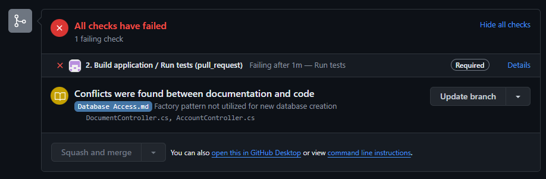

# Effective, Enforced Documentation Control with LLMs

I would not describe myself as a particularly talented software engineer. Of the production code I've written, I would describe it as 15% pretty bad, 5% pretty good, and 80% passable. This is more a reflection of the profession than I think it is demonstrative of my ability. Writing code is hard. _Reading code_ is even harder. I think this is why despite a successful career thus far I still often feel like I'm just not any good at this. But I still try, and I'm always looking for little ways to leg up. LLMs have been useful. What I really find useful is **good documentation**. More than anything, when I'm trying to understand a system or process, what I _want_ is a meticulously defined markdown file or PDF that explains it to me effectively. We don't always have this luxury, but think that there's a way in this age that we _could_, using **LLMs** and something called **enforced documentation control**.

I would like to start this conversation by entertaining two contradictory ideas about documentation:

## Documentation is good

Finding good documentation invokes a practically euphoric chemical reaction in my brain. Complex technical topics and systems, explained clearly in readable, human language is one of the best tools we have for understanding such topics and systems. Documentation about a very specific system that _I happen to be working on?_ Look at those thousands of lines of code I _didn't have to read_, because some developer was nice enough to reason it out on paper.

More than that, documentation serves as a bridge between different types of people. It connects non-technical people and technical people. It connects experienced engineers with junior engineers. It bridges gaps in knowledge in a way that's much more permanent. An engineer could get hit by a bus, taking all of his ideas and knowledge about his work with him. The documentation he wrote stays behind, where it can hopefully nurture and assist others.

**Idea #1:** Every codebase should have a rich literature of documentation that accompanies it.

## Documentation is bad

Lots of developers hate writing documentation, and for good reason. Writing documentation is usually a little bit boring, and tedious. It takes a lot of time, time that could be better spent writing code. There's also the fact that a lot of documentation is _bullshit_. And I don't mean bullshit colloquially, I mean it in a technical sense. If you've never heard the technical definition of bullshit, it's expressed in Harry Frankfurt's essay [_On Bullshit_](https://en.wikipedia.org/wiki/On_Bullshit). He defines bullshit as "speech without regards to the truth". This is different from a lie, where the speaker knows the truth of a matter and violates it anyways. I feel this effect on documentation is rarely due to an engineer's purposeful, malevolent effort. The _bullshitification_ of software documentation happens much more subtly, and is probably more easily attributed to priorities, or just straight up laziness. Take this example:

```c#

    /// <summary>
    /// Sends the same email to all addresses in a distribution list, logs any relevant errors. Fails gracefully on a per-email basis.
    /// </summary>
    /// <param name="distributionList"></param>
    /// <param name="subject"></param>
    /// <param name="message"></param
    private async Task SendEmailsToDistributionList(IEnumerable<string> distributionList,
        string subject, string message)
    {
        for (string address in distributionList)
        {
            try
            {
                bool status = await EmailService.SendEmailAsyncWithRetry(address, subject, message, retry = 5);
                if (!status)
                {
                    Log.Error($"Error sending email to {address}.");
                }
            }
            catch (EmailException ex)
            {
                Log.Error(ex, $"Exception when sending email to {address}.")
            }
        }
    }

```

This code takes a **subject** and **message** and passes it to the injected `IEmailService` so that it can send the same message to all the email addresses in a distribution list. Since our function is allowed to fail gracefully (and silently), it might actually make more sense to move our logging into the email service, so that other parts of our app that use the `IEmailService` don't have to implement their own logging for failures. This saves on redundant code. So now our function looks like this:

```c#

    /// <summary>
    /// Sends the same email to all addresses in a distribution list, logs any relevant errors. Fails gracefully.
    /// </summary>
    /// <param name="distributionList"></param>
    /// <param name="subject"></param>
    /// <param name="message"></param
    private async Task SendEmailsToDistributionList(IEnumerable<string> distributionList,
        string subject, string message)
    {
        for (string address in distributionList)
        {
            await EmailService.SendEmailAsyncWithRetry(address, subject, message, retry = 5, failQuietely = true);
        }
    }

```

I think this is a nice change (as an example at least). Do you see the problem we've just created though? The header documentation for the function is now wrong. What's worse - it's only wrong in an implicit sense. Nothing about the functionality has changed - all the same logic from before the change is included here, just abstracted away into a different part of the codebase. This function summary is not lying - but it's _misleading_. These are the types of little things that make documentation just a little bit less trustworthy - a little bit more _bullshit_ than they ought to be.

As authors of software, we are only a single code change from rendering our documentation bullshit. We could make the extra effort to check our documentation anytime a code change is made, but we don't always do that. Changes like this can easily slip through a code review. Code is material; it exists in the physical world. When it breaks, so do our lives, because suddenly something is broken **right now and we have to fix it.** Customers are affected. Money is lost. Documentation can break too, but there's never as great an incentive or urgency, because it’s largely immaterial. We don't always notice when it's incorrect. When it breaks, the consequences often never come at all, or they blindside us way down the line.

Additionally - broken documentation is actually _worse_ than no documentation, because it is wrong information that presents itself as the truth. Broken documentation is a false positive.

If you're an engineer, there's a tempting answer: _screw the documentation! I'll just write my code in a "self-documenting" style._ I don't disagree with that idea. You should try and make your code as simple and explanatory as possible. But this idea doesn't really scale - you can't always self-document an entire system or application.

**Idea #2:** There are a lot of very good reasons to _not_ document your code.

## Don't give up

The problem with documentation, as I've stated, is that it is immaterial - its purpose is to serve as a helpful abstraction; a human-readable representation of a complex system. If the system changes, the onus is on the documentation to change and stay current. If the _documentation_ changes however, there's no enforcement for the software to also change - it's happy to keep tumbling along, behaving in the exact way it always has.

But what if we flipped things on its head? What if we made our documentation as material as our code? Maybe it would look a little something like this:



You can probably see where I'm going with this, but just to spoil it: I think LLMs have made technical documentation very relevant as part of the build process, and maybe even the code review process. What if you never merged unless you _knew_ your documentation and your code were in sync? Previously, the only way to do this was to spend as much time verifying documentation as you did writing features and fixing bugs. But if you had a reliable model running this for you, then that's a lot of manual work you don't have to do.

### Making Documentation Real

If we want to care about writing good quality code that works, _and_ writing effective documentation that stands on its own, we need to square this circle: we need to make our documentation as **real** as our code.

Here's a sketch of how I think this could work:

1. In your repo, create a `Documentation` directory, and fill it with documentation for your project. Fill it with best practices, API references, microservice definitions, common patterns, security documentation, architectural diagrams, flowcharts. Put a whole document in here explaining why your team uses spaces or tabs. Write a document where you tell the story of that one time the intern broke the deployment pipeline because he changed the new release's version number to v🍾.🥴.🤮.

2. Incorporate a **Documentation Control** system, powered by your LLM of choice. The half-assed recreation above shows it as a blocker on a PR (probably created via a GitHub action), but it could a CLI tool, or simply incorporated into your build pipeline of choice.
3. Run your DC control system ad-hoc, or as part of your CI. Track conflicts between documentation and code the exact same way that you might track conflicts between code in different branches. If there are conflicts, **force** the author to do one of two things:
   1. Update the code to be in-line with the documentation
   2. Update the documentation to be in-line with the code (being careful to think about other places that the DC system might throw out conflicts if this route is taken)

I'm choosing to leave a lot up to the imagination here, because this is a silly idea that I don't have the time to really implement and interface with. Off-the-cuff, there's a few issues I can think of:

1. [LLMs themselves are kinda bullshit](https://link.springer.com/article/10.1007/s10676-024-09775-5)
2. Security issues; preventing your LLM from ingesting unique, sensitive material about the inner workings of your system, and regurgitating it for a bad actor.
3. The idea of a "documentation conflict" has the potential to be far less binary than something like a typical merge conflict in source control. How do you address the grays in-between?
4. Culture. I can imagine some variation of this conversation would probably play out in Teams and Slack worldwide if we had this:

   > **Dave**: "Hey Marty, I just opened a PR. Can you review?"

   > **Marty**: "Sure thing! Code looks good. _breathes in sharply through teeth_ Ooh, looks like you've got a bunch of **documentation conflicts**."

   > **Dave**: "Yeah don't worry about that, it's just a bunch of bullshit."

   > **Marty**: "Okay lmao" \*_squash_\*

I don't want to hedge too much, because I do think that these problems can be addressed. LLMs are getting better every day. A lead that cares about documentation conflicts as much as he does clean code might be able to implement this idea successfully across his org.

### Documentation-Driven Development: Made Possible

In addition to being a useful maintenance and review tool, I think it might even possible to take this idea one step further. What if your project was built **documentation-first**? Instead of writing code from stories derived from requirements, you write documentation from those requirements. Then you build features, branching frequently, and only merging to `main` _if_:

1. Your code passes code review, conducted by other engineers.
2. Your code passes _documentation review_, conducted by your model.

Seems strange, and I can't really begin to unpack all the possible problems at this stage. I haven't even worked within a TDD or BDD type environment long enough to know how I feel about that particular style of development. But I think if you had a reliable model, something you _know with reasonable certainty_ you can trust to effectively manage your documentation control, then maybe it could work. At this stage, I think the former use case as a repository maintenance tool is probably more realistic and useful, but I started this idea with something like documentation-driven development, and it feels wrong to abandon outright just because I can't parse it fully.

I'm also not the first person to [come up with something like this](https://playfulprogramming.com/posts/documentation-driven-development). Like I mentioned, BDD is a thing (along with ATDD). Perhaps a documentation control system (I also like to think of it as an **enforcer**) could augment these methodologies, or maybe it could be spun off into its own thing like I've described above. At this point, I'm just in ideas land.

## Conclusion

To bring it back home, strict documentation has its goods and bads. I think this approach - **enforced documentation control**, has the ability to eliminate _a lot_ of the bad aspects, under the right circumstances. It has the ability to force more careful consideration of code and system design, both in the micro and macroscopic senses, and it's a way to effectively bridge technical knowledge between technical people (and non-technical people) in a way that does not get stale or begin to smell. We audit systems and codebases all the way time - why not docs too?

<style>
    p {
        line-height: 30px;
        font-size: 18px;
    }

    ol {
        line-height: 30px;
        font-size: 16px;
    }

    ul {
        line-height: 30px;
        font-size: 16px;
    }
</style>
