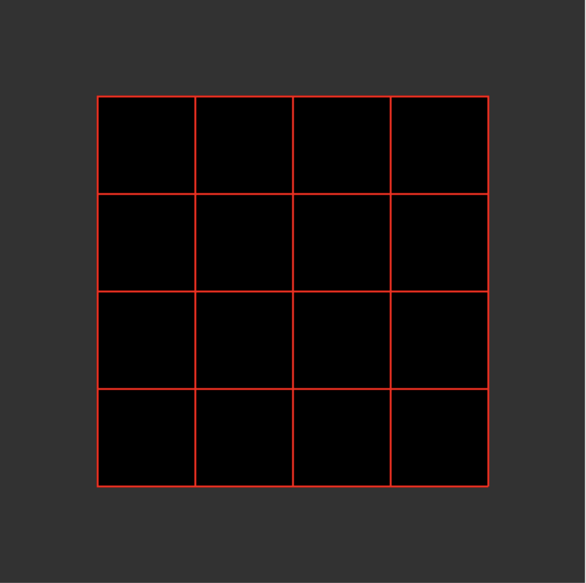
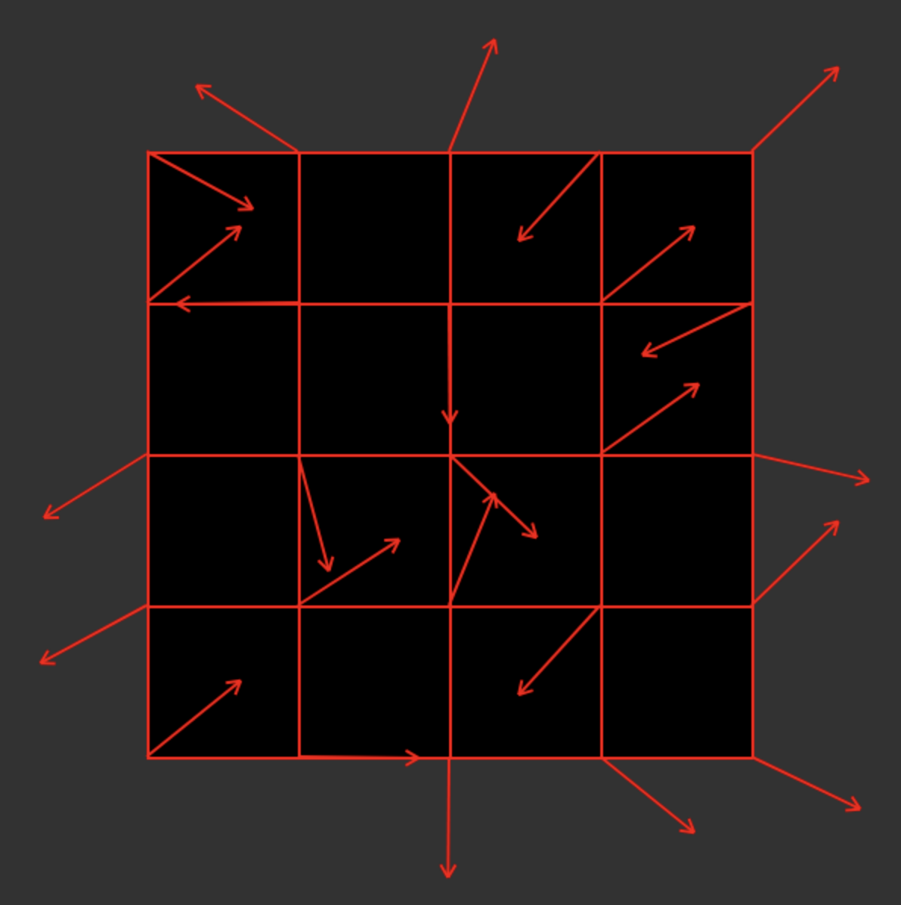
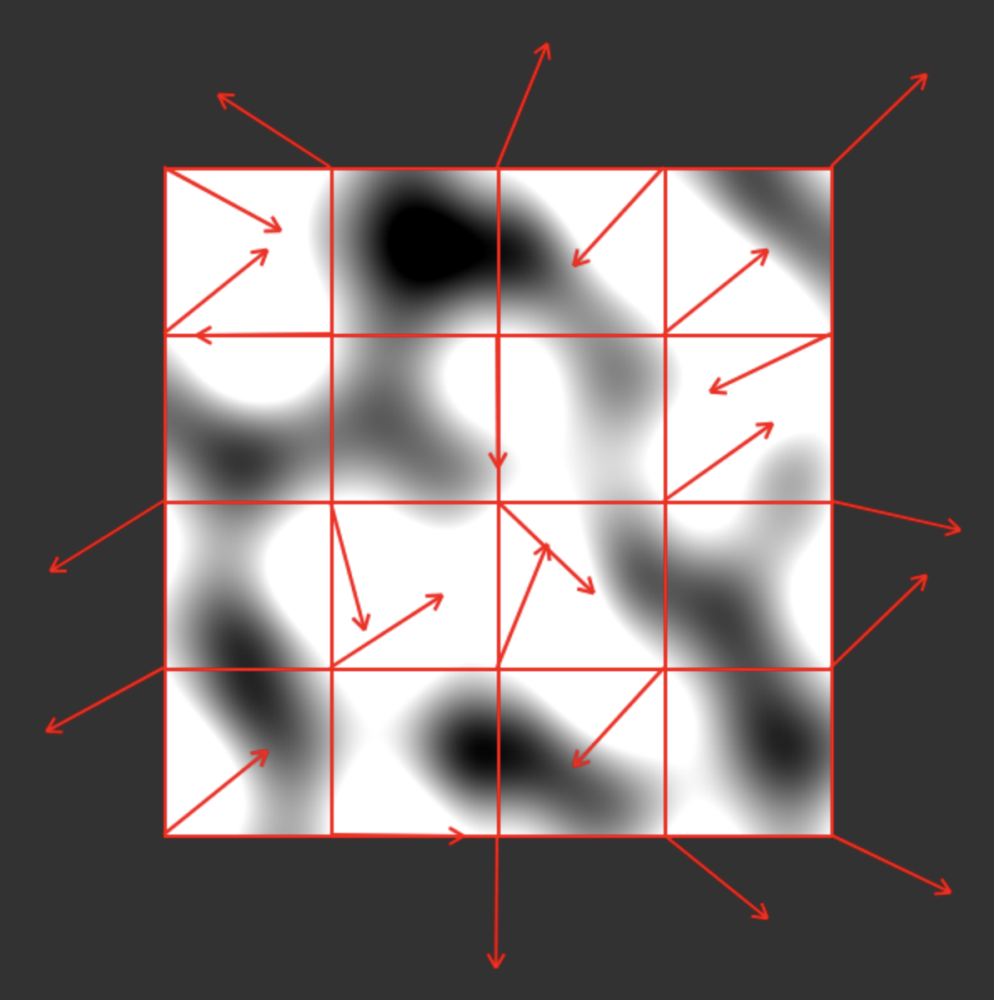
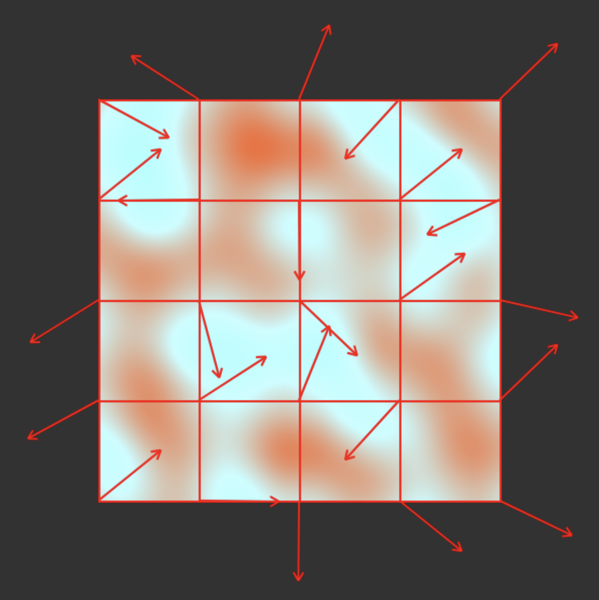
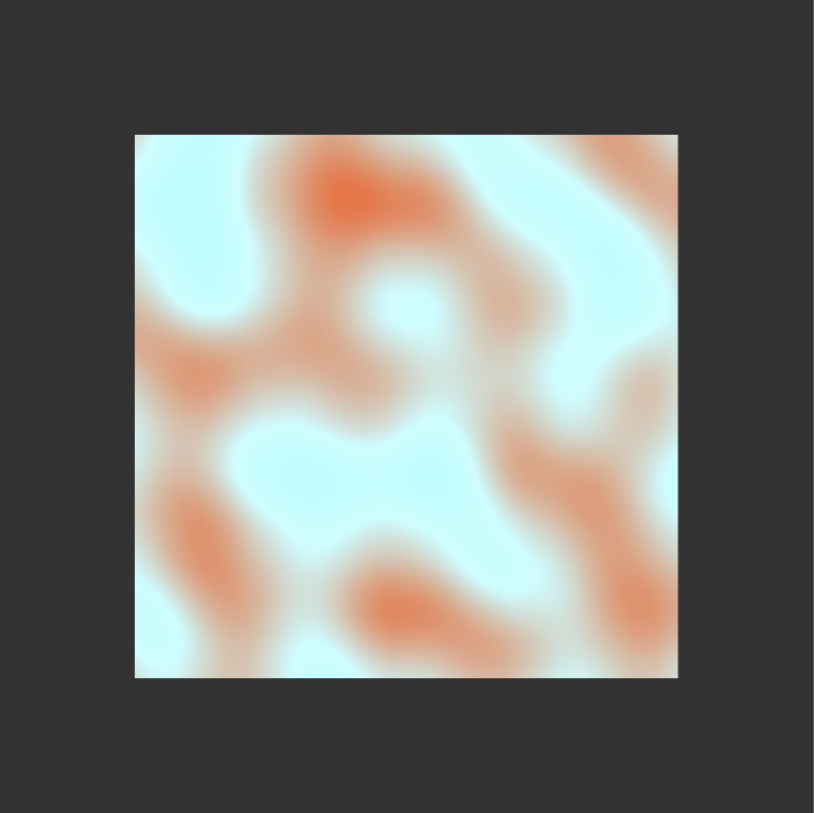

# Introducing Evicons

## How it started
I like GitHub Identicons. They're kind of charming, you know? Something simple to give your users to distinguish themselves. I kept [mine](https://GitHub.com/Identicons/evklein.png) as my main profile picture for a long time.


I also like the idea of building my own Identicons, so I decided to build something for this blog, to distinguish between pages, posts, or projects. You've probably seen them floating around on this site (there's one at the top of this post). I'm pretty proud of how they turned out and thought I'd document the process here.

## To each their own

GitHub Identicons are unique to their user, and are calculated via a cryptographic hash of the user's username (according to [this post](https://GitHub.blog/2013-08-14-Identicons/)). I like the cryptography aspect of this, but I think we can use the seed in a more interesting way, and I'll get to that. The point is, our Identicons should be ***cryptographically distinct***, deterministic based on their input, which we will call the **seed**. An Evicon should never be shared by more than one seed. To accomplish this, we can do the same thing that GitHub does and pass the seed through a cryptographic hash function. We'll work with MD5 for this implementation, same as GitHub. For our seed, we'll use whatever identifying piece of information we have available for the item we want an Evicon associated with. For example, for blog posts like this one, the seed is simply the title of the post.

Fun fact: I learned that GitHub Identicons only use the _first fifteen_ characters of their hash for their image generation. So while it’s practically impossible, one could theoretically find two usernames that share an identicon. We'll account for this in our own implementation to ensure that each seed actually has no shared Evicons.


## A whole lotta noise

I think an animation would be nice, and with our MD5 hash we should have plenty of information we can use to 'seed' the animation, at least for some initial state. I've opted to use <a href="https://en.wikipedia.org/wiki/Perlin_noise">Perlin noise</a> to generate the animation. Perlin noise is a pretty popular algorithm, especially in the game development space, and is most often used to generate noise maps for terrain generation. It has a nice effect to it, so I built my own implementation that can accept an input seed and generate a completely unique animation of that seed. I'm not going to walk through all the code for this (full source is available [here](https://GitHub.com/evklein/blog/blob/master/src/scripts/eviconsV1.js)), but I will document the important parts as well as some struggles I ran into along the way.

The algorithm goes, roughly, like this:

1. Define a grid. Place vectors at every intersection of the grid lines in random directions. These are our **Gradient Vectors**. Normalize them.

<div class="img-row">





</div>

2. For each pixel in our image, find the four grid corners that surround it, and draw four more vectors for this pixel, with the origin sitting at its respective corner and its end coordinates laying at the pixel's position. These are our **Offset Vectors**.

```javascript

    function drawPerlinAtPosition(x, y, imageData,  gradientVectors, colors,
                                    gridSegmentPxWidth, gridSegmentPxHeight) {
        // Find grid segment
        var gridSegmentX = Math.floor(x / gridSegmentPxWidth);
        var gridSegmentY = Math.floor(y / gridSegmentPxHeight);

        ...

        var offsetVectors = [
            { i: (x - topLeftPosX) / gridSegmentPxWidth, j: (y - topLeftPosY) / gridSegmentPxHeight },
            { i: (x - topRightPosX) / gridSegmentPxWidth, j: (y - topRightPosY) / gridSegmentPxHeight },
            { i: (x - bottomLeftPosX) / gridSegmentPxWidth, j: (y - bottomLeftPosY) / gridSegmentPxHeight },
            { i: (x - bottomRightPosX) / gridSegmentPxWidth, j: (y - bottomRightPosY) / gridSegmentPxHeight },
        ];

        ...

```

3. For each of our offset vectors, find the respective Gradient Vectors and calculate a dot product between the vectors. Store these four dot products in a list.

```javascript

    let dotProducts = [];
    for (var i = 0; i < offsetVectors.length; i++) {
        let gradient = gradientVectorsForPosition[i];

        let dotProduct = offsetVectors[i].i * gradient.i + offsetVectors[i].j * gradient.j;
        dotProducts.push(dotProduct);
    }

```

4. Interpolate the dot products, first along the x-axis, and then once more along the y-axis. This final interpolation is our **Perlin noise value at that point.**

```javascript

    // Interpolate x
    var x1 = interpolateDotProducts(dotProducts[0], dotProducts[1], relativeX);
    var x2 = interpolateDotProducts(dotProducts[2], dotProducts[3], relativeX);

    // Interpolate y using the results of x interpolation
    var factor = interpolateDotProducts(x1, x2, relativeY);

    ...

    function interpolateDotProducts(a, b, t) {
        return a + smoothstep(t) * (b - a);
    }

    function smoothstep(t) {
        return t * t * t * (t * (t * 6 - 15) + 10);
    }


```




5. Use our perlin noise value and interpolate it between our primary and secondary color to get the final pixel hue. How these colors are chosen will be discussed more later, but just know that I wanted the output to be more than a grayscale map.

```javascript

    function interpolateColor(color1, color2, factor) {
        const result = color1.slice();
        for (let i = 0; i < 3; i++) {
            result[i] = Math.round(result[i] + perlinFactor * (color2[i] - color1[i]));
        }
        return result; // <-- Final hue for pixel
    }

```

6. Repeat for all pixels in the image.

<div class="img-row">





</div>

Done! Not without some headaches, but I did eventually get an implementation of this working in Vanilla JS, and that's ultimately what you can see on this site.

#### Animating

The above algorithm only generates a single perlin noise image, but we want an animation of that noise. We can loop two additional steps to this algorithm to achieve the animation:

7. Rotate each **Gradient Vector** slightly.

```javascript

    function rotateGradientVectors(gradientVectors) {
        for (let y = 0; y <= NUMBER_OF_SEGMENTS; y++) {
            for (let x = 0; x <= NUMBER_OF_SEGMENTS; x++) {
                let gradient = gradientVectors[`${x}:${y}`];
                let angle = Math.atan2(gradient.j, gradient.i); // Get the current angle of the gradient
                let newAngle = angle + Math.sin(TIME_INCREMENT); // Increment the angle by t for rotation

                gradientVectors[`${x}:${y}`] = {
                    i: Math.cos(newAngle),
                    j: Math.sin(newAngle),
                };
            }
        }
    }

```

8. Re-render all pixels.


The re-calculation of the gradient vectors will cause the pixel hue to be recalculated just slightly. As the vectors continue to rotate, they'll approach their initially set positions, and then the animation begins from the beginning.

### What about the seed value?

There's two ways that the inputted seed value affect the animation: defining the colors and defining the initial gradient vectors.

In step #1 I mentioned that the Gradient Vectors should be assigned to a "random" direction, but we already _have_ a random value! We can simply use the MD5 hash of our seed to get the _i_ and _j_ values for each vector, and continue looping through the characters of the hash 2 at a time to build a list of vectors.

Two characters of our hash string will yield two digits of a base-16 number, which translates to a number in decimal ranging between **0 and 256**. That gives us plenty of range of direction, but what if we want some of our vectors to be pointing in _negative_ directions? To do this we can establish certain _chosen indices_ using a static list of numbers that are the same every time. Then, to determine which vectors values should be negative, we can find the digits at those indices and mark the value as negative if it is <= 0x08, or positive if it's above 0x08. I chose the Fibonacci sequence for this list of indices, for no other reason than it's more interesting than me typing out a random array like [1, 7, 9, 15, ...].

```javascript

    function getFibonacciSequence() {
        let fibonacciSequence = [];
        let n1 = 1, n2 = 2; // Offset Fibonacci so we always get different numbers
        let numberOfSequenceItems = (NUMBER_OF_SEGMENTS + 1) * (NUMBER_OF_SEGMENTS + 1) * 2;
        for (let i = 0; i < numberOfSequenceItems; i++) {
            fibonacciSequence.push(n1);
            let nextTerm = n1 + n2;
            n1 = n2;
            n2 = nextTerm;
        }
        return fibonacciSequence;
    }

    function getRandomDirectionByHash(hash, index) {
        while (index > hash.length) index -= hash.length;
        return parseInt(hash[index], 16) < 8 ? -1 : 1;
    }

```

And then below, when we build our Gradient Vectors

```javascript

    for (let y = 0; y <= NUMBER_OF_SEGMENTS; y++) {
        for (let x = 0; x <= NUMBER_OF_SEGMENTS; x++) {
            let originX = x * gridSegmentPxWidth;
            let originY = y * gridSegmentPxHeight;
            let nextSeedX = parseInt(hash.substring(seedIncrement, seedIncrement + 2), 16) *
                getRandomDirectionByHash(hash, fibonacciSequence[directionIncrement++]);
            let nextSeedY = parseInt(hash.substring(seedIncrement + 2, seedIncrement + 4), 16) *
                getRandomDirectionByHash(hash, fibonacciSequence[directionIncrement++]);

    ...

```

### A pop of color

There's 16 bytes in an MD5 hash, which results in a hexadecimal value with thirty-two digits. We can take the first six digits and the second six digits, and we now have two "random" colors that we can use. So the hash `ef8254cee2dab002fdcc623de5da9b23` translates to:

<div style="width: 200px; height: 30px; display: flex; text-align: center; margin: auto;">
    <span style="background-color: #ef8254; border-radius: 15px; min-width: 30px; min-height: 30px; margin-right: 10px;"></span>
    <b style="margin-top: 3px; margin-right: 10px;">#ef8254</b>
    <span style="background-color: #cee2da; border-radius: 15px; min-width: 30px; min-height: 30px; margin-right: 10px;"></span>
    <b style="margin-top: 3px">#cee2da</b>
</div>

## Drawbacks

There's a few drawbacks to our Perlin Noise approach to the Evicon, (I've affectionately dubbed the script `EviconsV1.js` for a reason) worth going over.

1. They're needlessly complicated.

2. It's fairly easy to generate an Evicon that resembles another one, so they're not really all that good at _identifying_ anything, even if they offer a decent approximation.

2. Perlin Noise has a time complexity of **O(2<sup>n</sup>)**, so it's relatively slow. I haven't seen much dip in browser performance, but it's something I'll have to keep on as the site grows. <a href="">Simplex noise</a> is an alternative (also developed by Ken Perlin) that might be a better candidate for next time.


## Fin

This was fun, I love the way they look, and I think they add a nice bit of visual flair to the site that you won't see elsewhere. You can mess around with creating your own Evicons [here](/evicons) (⬅️ credit to <b>@JVanAuken</b> for the idea to build this page).