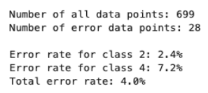
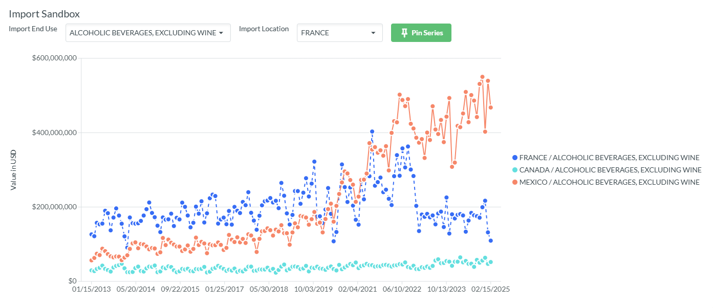
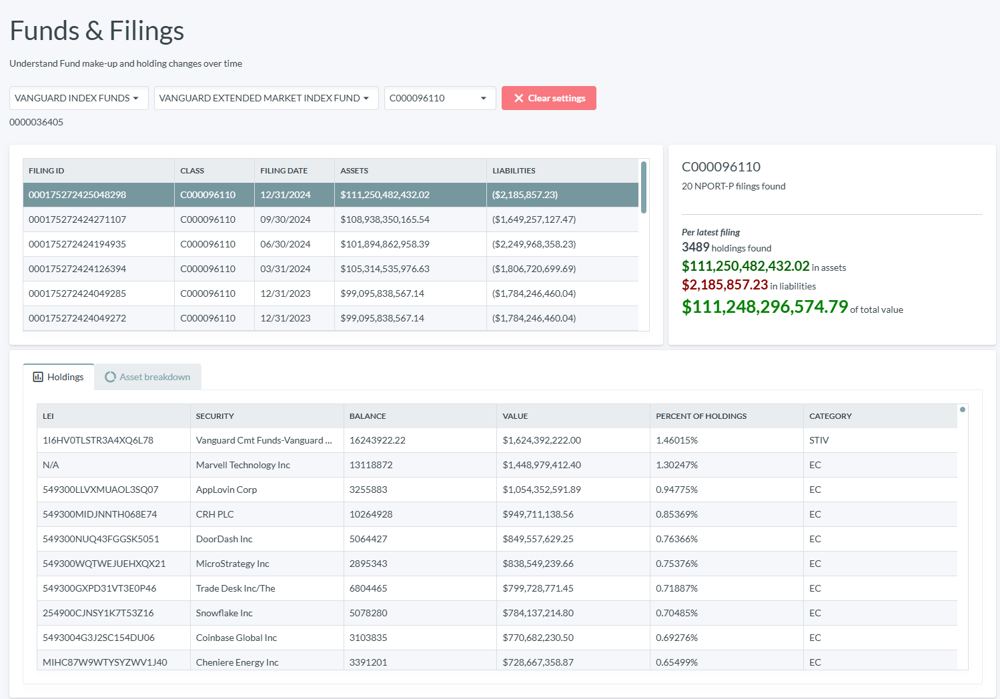
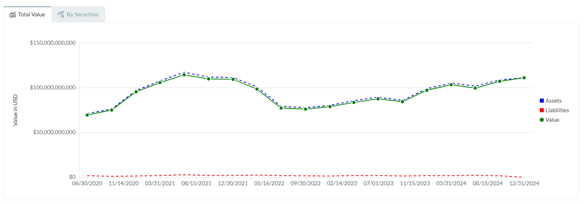
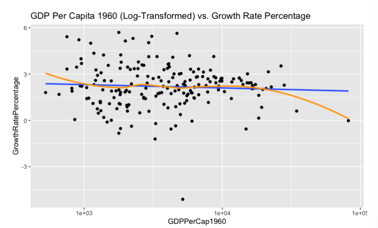
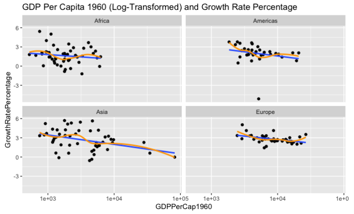

# Grad School Check-in: ~40% Done 

Yesterday I submitted my last assignments for my graduate school classes, and I realized I haven't written much here about the experience of getting my Masters (Data Science @ IU). I only have one week before my summer semester starts, so I thought I'd pump out a quick piece about some of the interesting things I've gotten to do so far.

## Big picture

I find school to be very fulfilling, and while my program is very challenging (especially when balancing with a full-time job), it's frankly nothing compared to my undergraduate years. Mostly I notice that I have a lot less bullshit-time; time spent on my phone, or sitting on my couch. Giving up real time with family, hobbies, etc. hasn't really hit me, though I do occasionally have to give up a round of golf. I chose a good time in my life to do this.

## Courses

Two semesters in, two classes each. So far I've taken:
- **D590: Introduction to Python Programming**: Frankly a pretty easy ride for me given my software development experience (Python was my first language, which I first started learning back in 2012). I'm actually glad I took this, mostly for the exposure it gave me to libraries like `pandas` and `matplotlib`. I haven't written much Python code in my career, but that will likely change, and it was good to start off easy and freshen up those skills.
- **S519: A Gentle Introduction to Statistics in R**: I enjoyed this course a lot, but "gentle" is a very subjective term. I struggled even with basic probability problems, and it was quite the adjustment carving out my week so that I routinely had 8+ hours to complete my assignments. The skills in this class I are essential, and I really enjoyed the opportunity to learn R.
- **S580: Introduction to Regression Models and Nonparametrics**: The sequel course to S519. More challenging, more dense, but you get to do some very fun things in this course. I feel like what I took away in S519 was very loose and abstract - concepts really came together here once you get to put things together and build models. Nonparametric testing and modeling methods are also very cool, and felt a little more "computer science"-y to me than some of the more distributional or probabilistic modeling that got touched on at the end of S519. This isn't a required course in my program, I took it as an elective, but I'm glad that I did because I feel some of the statistical weaknesses that held me back my first semester really has been addressed due to the concepts here. I feel like I'll be able to take my data science skills to the next level now that I feel comfortable with ideas like logistic regression and generalized additive models. Shoutout to Dr. Luen - easily my favorite professor so far.  
- **I535: Management, Access, and Use of Big Data**: This course was all about breadth, not depth, in dealing with all the different pieces of data management. It touched on a little bit of everything - cloud, virtualization, lifecycles, pipelines, governance, security, and more. I've enjoyed this class the least, so far. The lectures were okay, but oftentimes they consisted of random YouTube videos or Ted talks that only half-related to the module content. I liked the assignments, and the final project had very loose requirements (giving me some time to build some cool stuff), but largely I wouldn't take this class again if I was going to do this program from the start. I just felt like I knew a little too much about most modules to get anything new.

## Cool stuff I've gotten to build

### K-means cluster algorithm: machine learning for breast cancer detection

For D590, our final project was to build a machine learning algorithm to detect breast cancer in subjects using a dataset of cellular samples. K-means clustering involves projecting attributes of an entity into an n-dimensional space and finding similar samples that live in that same "space" using euclidean distance (or other distance-based heuristics).

The project involved performing exploratory data analysis, processing and cleaning data, and then training the algorithm before testing its efficacy. My resulting implementation was able to successfully predict whether cell samples were benign or malignant with an overall 96.0% accuracy.

This was a great project for learning about a basic machine learning algorithm and how it might be used in practice.

### Watchdog: financial and economic pipelines and dashboards with Python and Blazor

Like I said, the final project for I535 was loose enough that students could pretty much build whatever they want, given that they could relate it back to the course materials in an interesting way. I chose to build a series of pipelines for scraping economic, financial, and trade data from multiple sources like the [Bureau of Labor Statistics](https://www.bls.gov/bls/api_features.htm), the [U.S. Census Bureau](https://www.census.gov/data/developers/data-sets.html), and the [SEC Edgar Database](https://www.sec.gov/search-filings). I actually think this could be an interesting product if it had some more work put into it. Some key features:
- Give users the ability to study U.S. trade patterns across commodities (imports and exports)

- Give users the ability to examine mutual and echange-traded fund holdings, including stocks, bonds, and other securities.

- Give users the ability to examine various economic indicators and CPI averages.

### Statistical Analysis of Economic Convergence in R

This was some of the most fun I've had so far - validating claims about the theory of [economic convergence]() using real data, in R, for S580. I've really come around on R. There's some syntactical funkiness for sure (wtf is with the 1-indexed arrays), but when it comes to doing real statistical work this is ultimately where I'm comfortable. The project involved studying OECD data around GDP for most countries to determine whether poor countries are more capable of explosive growth than larger countries. The report I authored determined that, given the data I had access to, the theory of economic convergence could not be confirmed with statistical methods like linear regression.

## Up next

I'm projected to graduate next Spring, at my current pace, which is admittedly very fast. Most students in my program take one class a semester, but I'd rather not be in school for 2+ more years.

This summer I'm taking a course on data visualization, and a series of mini-courses that span all sorts of different topics, which I'm sure I'll come back and write all about. I'm expecting the next two semesters to be very hard, but I'm looking forward to learning some new skills and wrapping this thing up soon. Thanks for reading!